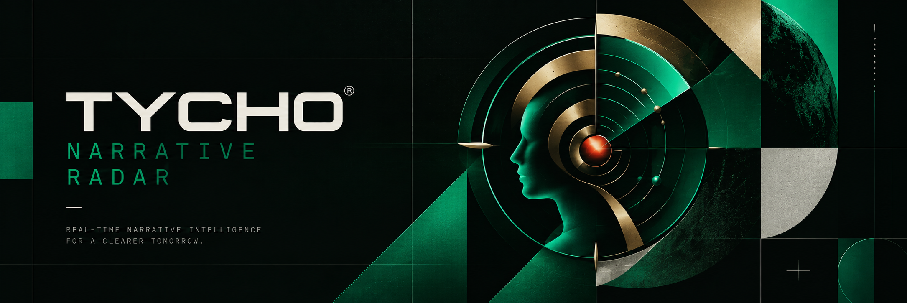

<div align="center">
  
</div>

# Tycho — Autonomous Solana Narrative Radar

Tycho is an autonomous macro-narrative radar designed to track, cluster, and label emerging themes in the Solana token ecosystem (specifically focusing on Pump.fun). Instead of looking at individual tokens in isolation, Tycho identifies spatial density among newly launched tokens to detect narrative breakouts and metas as they form.

[**X / Twitter**](https://x.com/TychoRadar) | [**Live Dashboard**](https://radar-tycho.vercel.app)

**Contract Address (CA):** `0xe2e4a2404c3923990ccc1e6435dc5b6476284992`

---

## ⚠️ What Tycho Is & What He Is Not

### What Tycho Is
* **An observational radar:** A completely autonomous pipeline that turns raw blockchain noise into readable narrative signals.
* **A semantic mapper:** It transforms token metadata (names, tickers, lore) into high-dimensional space (768-D vectors) using LLMs.
* **A mathematical grouper:** It uses DBSCAN clustering to find spatial density among tokens, grouping them by AI, not by hand.

### What Tycho Is Not
* **Tycho does not predict price or future trends.** Tycho measures what is happening *right now*, not guessing what will happen tomorrow.
* **Tycho does not have an edge that guarantees returns.** The "momentum" indicators (accelerating/slowing) are purely mathematical derivatives of historical token counts, not financial advice.

---

## 🛠️ Architecture & Tech Stack

```text
┌─────────────────────────────────────────────────────────────────────────┐
│                           EXTERNAL DATA SOURCES                         │
│  ┌──────────────────────┐  ┌─────────────────────┐  ┌────────────────┐  │
│  │ Pump.fun Feed        │  │ Google Gemini API   │  │ Anthropic API  │  │
│  │ (Token Ingestion)    │  │ (Embeddings)        │  │ (Labeling)     │  │
│  └──────────┬───────────┘  └──────────┬──────────┘  └───────┬────────┘  │
└─────────────┼─────────────────────────┼─────────────────────┼───────────┘
              │                         │                     │
┌─────────────▼─────────────────────────▼─────────────────────▼───────────┐
│                            WORKER LAYER (CRON JOB)                      │
│  ┌──────────────────┐ ┌──────────────────┐ ┌──────────────────────┐     │
│  │ Ingest Worker    │ │ Embed Worker     │ │ Cluster & Label      │     │
│  │ (Fetch new coins)│ │ (Gemini 768-D)   │ │ (DBSCAN + Claude 3)  │     │
│  └──────────┬───────┘ └──────────┬────────┘ └───────────┬───────────┘     │
└─────────────┼────────────────────┼──────────────────────┼───────────────┘
              │                    │                      │
              ▼                    ▼                      ▼
┌─────────────────────────────────────────────────────────────────────────┐
│                           DATABASE LAYER                                │
│  ┌───────────────────────────────────────────────────────────────────┐  │
│  │ PostgreSQL (via Supabase) + Drizzle ORM                           │  │
│  │ (Tokens, Vectors, Clusters, Signal Histories)                     │  │
│  └───────────────────────────────────────────────────────────────────┘  │
└─────────────────────────────────────────────────────────────────────────┘
              │
              ▼
┌─────────────────────────────────────────────────────────────────────────┐
│                       FRONTEND LAYER (SvelteKit)                        │
│  ┌──────────────────────────┐ ┌──────────────────┐ ┌─────────────────┐  │
│  │ Interactive Radar UI     │ │ Realtime Signals │ │ Track Record    │  │
│  └──────────────────────────┘ └──────────────────┘ └─────────────────┘  │
└─────────────────────────────────────────────────────────────────────────┘
```

| Layer | Technology | Function |
| :--- | :--- | :--- |
| **Backend & UI** | SvelteKit | SSR, API Endpoints, and Interactive UI with GSAP animations. |
| **Database** | PostgreSQL (Supabase) | Relational storage for tokens and clusters. |
| **ORM** | Drizzle ORM | Type-safe database queries. |
| **AI (Vectors)** | Google Gemini API | `text-embedding-004` to map semantic lore into 768-D vectors. |
| **AI (Labeling)**| Anthropic Claude Haiku | Fallback naming chain to assign human-readable labels to DBSCAN clusters. |

---

## 🧮 Data Pipeline & Clustering Formulation

**1. Ingest**
A background cron job continuously polls for newly launched tokens, reading their name, ticker, and social data.

**2. Embed**
Each token's text data is passed to Gemini to generate a vector embedding.
`vector = embed(token.name + token.ticker + token.lore)`

**3. Cluster**
The system uses Density-Based Spatial Clustering of Applications with Noise (DBSCAN) to group the vectors. If multiple tokens are launched with the same theme (e.g. "Cat coins"), their vectors will map closely in space and form a cluster.

**4. Label**
Once a cluster forms, its members are analyzed by Claude to generate a descriptive label, exposing the "meta" before humans notice it manually.

---

## 📂 Repository Structure

```text
Radar/
├── src/
│   ├── lib/
│   │   ├── components/        # Svelte UI Components (SignalRow, Panels)
│   │   ├── db/                # Drizzle ORM schema and connection
│   │   └── features/          # Domain logic for Radar and Track Record
│   ├── routes/
│   │   ├── (app)/             # Main Dashboard, Brain, Track Record pages
│   │   ├── (marketing)/       # Landing Page
│   │   └── api/               # Serverless API endpoints (cron, etc.)
│   └── scripts/               # Backfill and utility scripts
├── static/
│   └── images/                # Static assets (logo, OG image)
├── .env.example               # Environment variables template
├── tailwind.config.ts         # Tailwind CSS styling configuration
└── svelte.config.js           # SvelteKit configuration
```

---

## 🚀 Getting Started

### Prerequisites
- **Node.js**: v18+ (bun recommended)
- **PostgreSQL**: Hosted (e.g. Supabase) or local

### 1. Clone & Install
```bash
git clone https://github.com/mark-readme/Radar.git tycho-radar
cd tycho-radar
bun install
```

### 2. Environment Variables
Create a `.env` file based on `.env.example`:
```bash
cp .env.example .env
```
Provide the following:
- `DATABASE_URL`: Connection string for PostgreSQL.
- `GEMINI_API_KEY`: Google AI Studio API key.
- `ANTHROPIC_API_KEY`: Anthropic API key.
- `CRON_SECRET`: Random string to secure the cron trigger.
- `PUBLIC_APP_URL`: App host URL (e.g., `http://localhost:5173`).

### 3. Database Setup
Push the schema to your PostgreSQL database:
```bash
bun run db:push
```

### 4. Seed Initial Data (Optional)
To test the application with real historical data without waiting for the cron job, you can use the provided backfill scripts:
```bash
bun src/scripts/gecko_backfill.ts
bun src/scripts/recluster.ts
bun src/scripts/reconstruct_history.ts
```

### 5. Run the Application
```bash
bun run dev
```

---

## 🔌 API & Cron Contract Overview

| Method | Endpoint | Description |
| :--- | :--- | :--- |
| `POST` | `/api/cron/cluster` | Executes the full pipeline (Ingest -> Embed -> Cluster -> Label). Requires `Authorization: Bearer <CRON_SECRET>`. |
| `GET`  | `/api/clusters` | Returns current live narrative metas and their momentum. |
| `GET`  | `/api/clusters/track-record` | Returns historical metas sorted by peak token count. |

**Important Note on Scheduling:**
For optimal results, the recommended interval is every 5 to 15 minutes. It is highly advised to use a dedicated external cron service (such as **cron-job.org** or **Upstash QStash**). Native GitHub Actions scheduled workflows have proven to be highly unreliable for short intervals.

---

## 📜 Name Origin & Homage

Tycho is named in tribute to **Tycho Brahe** (1546–1601), the Danish astronomer whose precise, exhaustive, and autonomous observations of planetary motion provided the empirical data that Johannes Kepler later used to uncover the laws of planetary motion.

Like Brahe, Tycho doesn't predict; it observes the chaotic noise of the blockchain with unwavering precision, providing the structured dataset that allows others to see the actual patterns.

---

## 📄 License & Disclaimer

**Disclaimer**: Tycho is an open-source machine learning experiment and observational radar, not a financial adviser. Mathematical momentum indicators do not forecast market trends. This platform measures what has already happened, not price targets.
